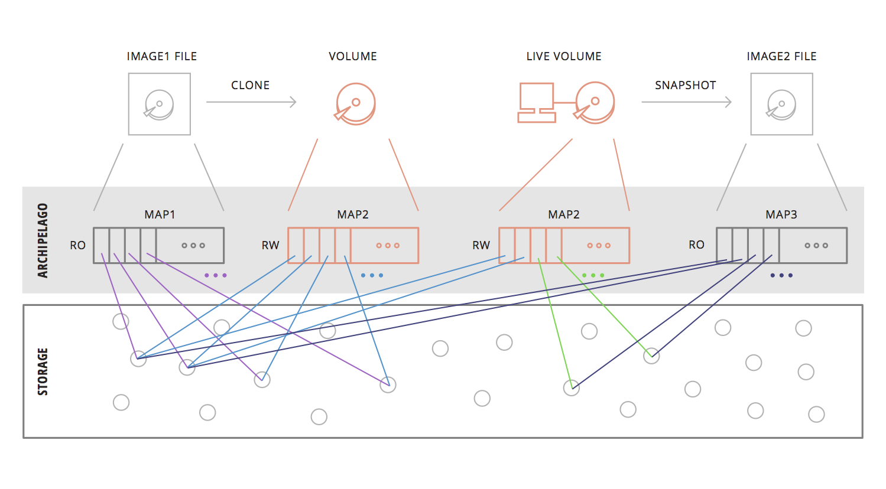
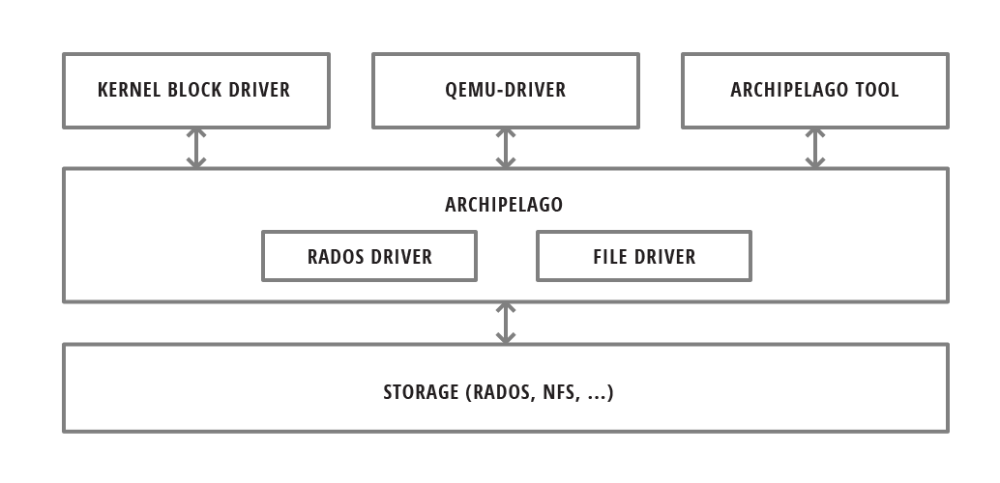

Administrator's guide
=====================

Overview
********

Archipelago is a distinct storage layer that provides the logic and interfaces
needed to integrate with a cloud platform, while in the same time being
agnostic to the underlying storage technology, which is used to store the
actual data.

In the figure below, we see Archipelago running in a number of physical nodes.
It provides different endpoints for volume access by VMs or file access via
HTTP:

.. image:: images/archipelago-overview.png
    :target: _images/archipelago-overview.png
    :scale: 100

It also provides the corresponding logic for thin volume cloning and
snapshotting independently from the actual storage. Archipelago is deployed on
each node where the volume will be used (e.g.: acting as a VM disk). The volume
is exposed as an independent block device and accessed as such. The data of
each volume can reside on any supported underlying storage type. The software
stack will take care of any coordination or concurrency control needed between
other nodes running Archipelago.

In the same way Archipelago may be deployed on a node that will act as an HTTP
gateway for files. It will then provide the corresponding endpoint and the
deduplication logic to export the data stored on the underlying storage as
files.

Archipelago's goal is to decouple the composition/snapshot/cloning/deduplicating
logic from the storage backend used.  Essentially, provide the necessary layer
where the aforementioned logic and volume handling is implemented and also
implement an interface with pluggable storage drivers, to operate over
different storage types. Finally, export different access endpoints for use by
the upper layers.

Idea
****

Every Volume inside a VM can be thought of as a linearly addressable set of
fixed-size blocks. The storage of the actual blocks is orthogonal to the task of
exposing a single block device for use by each VM. Bridging the gap between the
VMs performing random access to Volumes and the storage of actual blocks is
Archipelago: a custom storage handling layer which handles volumes as set of
distinct blocks in the backend, a process we call volume composition.

For the actual storage of blocks, Archipelago is agnostic to the storage backend
used. Through pluggable storage drivers, Archipelago can support multiple
storage backends to suit the needs of each deployment. We currently provide two
storage drivers. One for simple files, where each object is stored as a single
file on the (shared) filesystem, and one for objects backed by RADOS. RADOS is
the distributed object store which supports the Ceph parallel filesystem. With
RADOS, we can solve the problem of reliable, fault-tolerant object storage
through replication on multiple storage nodes.

As mentioned before, Archipelago composes the volume through individual blocks.
This is accomplished by maintaining a map for each volume, to map offset in a
volume with a single object. The exact offset inside the object, is calculated
statically from the fixed object size and the offset in the volume. But having
this map and the composition subsystems, allow us to do much more than simple
volume composition. Archipelago offers Copy-On-Write snapshottable volumes.
Furthermore, each snapshot can be hashed, to allow deduplication to play its
part, reducing the storage cost of each hashed object. Furthermore, Archipelago
can integrate with Pithos, and use Pithos images to provision a volume with
Copy-On-Write semantics (i.e. a clone). Since Pithos images are already hashed,
we can store Archipelago hashed volumes, which are indistinguishable from a Pithos
image, along with the Pithos images, to enable further deduplication, or even
registering an archipelago hashed snapshot as Pithos image file. The above
process is illustrated on the following figure.

Archipelago is used by Cyclades and Ganeti for fast VM provisioning based on CoW
volumes. Moreover, it enables live migration of thinly-provisioned VMs with no
physically shared storage.

Bare in mind that currently Archipelago does not provide any garbage collection
functionality. Should you decide to use it, make sure your storage capacity can
meet your data needs.

Endpoint and Backend drivers
****************************

Archipelago allows users to manage and access the underlying data, which is
backed by various storage types. In order to do that, Archipelago can provide
multiple endpoints for the user or upper layers to interact. Some of them are:

 * block device driver
 * qemu driver
 * user provided process
 * command line tool
 * http gateway for files

It also implements different drivers to interact with different types of
underlying storage technologies.

Internal Architecture
*********************

Archipelago consists of several components, both userspace and kernelspace,
which communicate through a custom-built shared memory segment communication
mechanism. This mechanism, which is called XSEG, also defines a common
communication protocol between these components and is provided by the library
``libxseg``.  Each Archipelago component is an *xseg peer*.  The segment
provides *ports*, where each peer binds. The peer then uses the port to
communicate with the other peers on the same segment. The communication consists
of *requests* that are submitted to the receiver's port request queue, and are
responded to the submitter's port reply queue.

This form of communication, allows us to develop distinct components for each
operation of Archipelago, while being able to communicate with exactly
the same protocol between these components.

Archipelago components
----------------------

Each Archipelago component serves a distinct purpose and coordinates with the
other components to provide the final service.

These components are described below.

The Volume composer (vlmcd)
~~~~~~~~~~~~~~~~~~~~~~~~~~~

Volume composer is responsible for the volume composition. Blktap devices direct
I/O requests on the volume, to the volume composer. Volume composer then
consults the mapper, to get the actual objects on which it will perform the
appropriate I/O. It then directs I/O requests for each individual object to the
blocker and wait for their completion. In the end, it composes the individual
responses, to respond to the original volume request from blktap.

The Mapper (mapperd)
~~~~~~~~~~~~~~~~~~~~

Mapper is responsible for keeping and updating the mappings from volume
offsets to individual objects which actually hold the data. It is also
responsible for creating new volumes, snapshotting existing ones and create new
volume based on a previously captured snapshot (clones). It stores the mappings
to the storage backend, from which it reads and/or updates them, keeping them
cached when appropriate. It also ensure that each action on the volumes, does
not happen unless the necessary volume locks are acquired.

The File blocker (filed)
~~~~~~~~~~~~~~~~~~~~~~~~

File blocker is responsible for storing each object as a single file in a
specified directory. It serves the requests for each objects as they come from
the volume composer and the mapper components. ``Filed`` currently requires that
all files are placed under one filesystem. The directory it operates on, must
not contain symlinks or mountpoints to different filesystems. Also the
permissions must be set to both read and write for the user Archipelago runs as
(default to ``archipelago``).

The RADOS blocker (radosd)
~~~~~~~~~~~~~~~~~~~~~~~~~~

RADOS blocker is another form of blocker which stores each objects as a single
object in a RADOS pool. It can be used instead of the file blocker, to create
and use disks over RADOS storage.

The Connection pooler (poold)
~~~~~~~~~~~~~~~~~~~~~~~~~~~~~

The connection pooler is a lightweight middleware that works between the
XSEG protocol (and the provided port mechanism) and the Archipelago client
(QEMU, block driver, userspace peers). When a client connects to the server a
connection will be assigned to it for the whole duration it stays connected.
The client can interact with the server and acquire a new port from the pool
or leave that port back to the pool. When the client disconnects, the server
will put back into the pool all the acquired client resources.

The Block devices (blktap)
~~~~~~~~~~~~~~~~~~~~~~~~~~

Each volume on Archipelago is exposed as a block device in the system
/dev/xen/blktap-2/ directory. These special devices are nothing more than just
another peer, which forwards the requests through the shared memory segment,
to the volume composer for completion.

In a nutshell, in archipelago, each blktap device communicates through the
shared memory segment with the volume composer. Then the volume composer
requests the objects on which it should perform the I/O from the mapper. The
mapper takes into account all the necessary logic (taking locks etc) and
retrieves the mappings from the storage, by requesting the appropriate objects
from the blocker responsible to hold the maps. It then performs any copy on
write operations needed and returns the mapping to the volume composer. The
volume composer then communicates with the blocker responsible for holding the
objects where the actual data reside and composes the responses, to respond to
the original request.

Archipelago mapfile architecture
--------------------------------

Each Archipelago mapfile begins with a header, in big endian format, as
follows::

    struct ArchipelagoHeader {
        uint32_t signature;
        uint32_t version;
        uint64_t size;
        uint32_t blocksize;
        uint32_t flags;
        uint64_t epoch;
    };

* The first 4 bytes contain the characters 'A', 'M', 'F', '.'.
* The next 4 bytes contain the format version used by the mapfile. Currently,
  there have been two versions of the format, version 1 and version 2. Pithos
  mapfiles weren't following any specific mapfile header format until now.
* The next 8 bytes contain the size, in bytes, of the file represented by the
  mapfile.
* The blocksize field gives the block size used by the storage backend.
* The value of the flags field is a mask of flags used to denote access
  permissions and properties of this mapfile.
* The epoch field is an index number used as a reference counter.

Archipelago's User/Group permissions
************************************

Archipelago runs by default as user ``archipelago`` and group ``archipelago``.
These groups are automatically created during installation.

Different Archipelago components use several "named" entities to communicate
with each other (e.g. a shared memory segment, named pipes). By having all
Archipelago components creating files (or directory entries in general) with
read and write permissions for both the user and the group, we ensure that these
distinct components can cooperate without permission problems. Furthermore,
different services or components that want to integrate with Archipelago can run
as their selective user, as long as this user belongs to the group
``archipelago``.

.. warning:: Due to a bug in gunicorn handling of supplementary groups, Pithos
             does not fall into the above category. The relevant gunicorn
             worker must be executed as user or group ``archipelago``. Please
             refer to the relevant Synnefo documentation.

Archipelago Integration with Synnefo and Ganeti
***********************************************

The following figure shows Archipelago, completely integrated with Synnefo and
Ganeti in a real-world, large scale cloud environment:

.. image:: images/synnefo-archipelago.png
     :target: _images/synnefo-archipelago.png
     :scale: 50

Tools
*****

There are three tools provided with Archipelago.
The ``archipelago`` tool, the ``vlmc`` tool and the ``xseg`` tool.

Archipelago tool
-----------------

``archipelago`` tool provides the basic commands to control Archipelago (i.e.,
starting, restarting and shutting it down). It is meant to be called by the init
scripts, but can also be called directly by the administrator.

Usage:

.. code-block:: console

  # archipelago command

Currently it supports the commands described below.  Each command supports an
optional peer argument to affect only the specified peer. Available peers are
defined in the configuration file. In the current version they are limited to
one of the following: ``vlmcd``, ``mapperd``, ``blockerm``, ``blockerb``.

* ``start [peer]``
  Start archipelago.

  If peer is specified, only the specified peer is affected.
* ``stop [-f] [peer]``
  Stop archipelago unless mapped resources exist. In that case, use the ``-f``
  option to stop Archipelago

  If peer is specified, only the specified peer is affected.
* ``restart [peer]``
  Restart archipelago or the specified peer.

  If peer is specified, only the specified peer is affected.
* ``status``
  Show the status of archipelago.

Archipelago volume commands
***************************

The ``vlmc`` tool provides a way to interact with Archipelago volumes. It is
meant to be used by the Ganeti ExtStorage scripts, but also directly from the
administrator to take actions on volumes.

Usage:

.. code-block:: console

  $ vlmc command [args]

Available commands:

**showmapped**: Show the mapped volumes and the Archipelago devices on that
node.

  Usage: ``$ vlmc showmapped``

**map**: Map the volume to a blktap device

  Usage: ``$ vlmc map <volumename>``

**unmap**: Unmap the specified device from the system.

  Usage: ``$ vlmc unmap </dev/xen/blktap-2/tapdev[0-..]>``

**create**: Create a new volume with an optional specified size from an
optional specified snapshot.

  Usage: ``$ vlmc create <volumename> --snap <snapname> --size <size>``

  Usage: ``$ vlmc create <volumename> --snap <snapname>``

  Usage: ``$ vlmc create <volumename> --size <size>``

  The ``--snap`` and ``--size`` are both optional, but at least one of them is
  mandatory. If snap is not specified, then a blank volume with the specified
  size is created. If size is not specified, the new volume inherits the size
  from the snapshot.

**snapshot**: Create a snapshot with the given name from the specified volume.

  Usage: ``$ vlmc snapshot <volumename> <snapshotname>``

**remove**: Remove the volume.

  Usage: ``$ vlmc remove <volumename>``

  This may not actually delete all the blocks, but makes the volume inaccessible
  for usage. All the blocks are removed later, when a garbage collection is
  invoked.

**info**: Show volume information. Currently returns only the volume size.

  Usage: ``$ vlmc info <volumename>``

**open**: Open an Archipelago volume. That is, taking all the necessary locks
and also make the rest of the infrastructure aware of the operation.

  Usage: ``$ vlmc open <volumename>``

  This operation succeeds if the volume is already opened by the current host.

**close**: Close an Archipelago volume. That is, performing all the necessary
functions in the insfrastrure to successfully release the volume. Also
releases all the acquired locks.

  Usage: ``$ vlmc close <volumename>``

  A explicit ``close`` command should be invoked an explicit ``open``, to
  release the volume, unless another action triggered an implicit ``close``.

**lock**: Lock a volume. This step allow the administrator to lock an
Archipelago volume, independently from the rest of the infrastructure.

  Usage: ``$ vlmc lock <volumename>``

  The locks are idempotent for the current owner of the lock. That is, a lock
  operation will succeed when the volume is already locked by the same blocker.

**unlock**: Unlock a volume. This allow the administrator to unlock a volume,
independently from the rest of the infrastructure.

  Usage: ``$ vlmc unlock [-f] <volumename>``

  The unlock option can be performed only by the blocker that acquired the lock
  in the first place. To unlock a volume from another blocker, ``-f`` option
  must be used to break the lock.

XSEG tool
-----------------

``xseg`` tool provides a way to interact in a very low-level manner with the
shared memory segment. It is meant to be used as a last resort recovery tool.
It is not recommended to use it under normal circumstances.

It is used as follows:

.. code-block:: console

    $ xseg <spec> [[[<src_port>]:[<dst_port>]] [<command> <arg>*] ]

where spec is:
``posix:<segmentname>:nr_ports:nr_dynports:segment_size:page_shift``. Normally a
shorter version of ``posix:<segmentname>:`` can be used to refer to the selected
segment.

A few notable commands are:

**create**: Creates a new spec according to the spec.

  Usage: ``xseg "posix:<segmentname>:nr_ports:nr_dynports:segment_size:page_shift" create``

**destroy**: Destroys a previously created segment.

  Usage: ``xseg "posix:<segmentname>:" destroy``

**reportall**: Prints a report about the segment's current status.

  Usage: ``xseg "posix:<segmentname>:" reportall``

**recoverport**: Used to recover all requests a peer had on the fly.

  Usage: ``xseg "posix:<segmentname>:" recoverport <peer port>``

**recoverlocks**: Used to recover all the locks a peer held when crashed.

  Usage: ``xseg "posix:<segmentname>:" recoverlocks <peer port>``

It also contains several other debugging and obsolete commands that will be
removed on future versions.

Archipelago locking system
**************************

Currently, Archipelago uses a locking system consisting of storage-based locks
to control concurrent accesses to the same volume and prevent its corruption.
Each lock is held by the ``blockerm`` peer of a node. Concurrency control within
the same node is handled by Archipelago, and more specifically by the ``mapper``
peer.  In general, if a ``blockerm`` peer crashes, the lock owner is lost but
the lock remains and needs to be broken.

Archipelago's locks change with the storage backend used for ``blockerm``. When
using a RADOS backend, ``radosd`` uses the native librados locks. These are tied
to the RADOS client id which is instantiated when the ``radosd`` is launched.
When using a file backend, the ``filed`` uses files as locks. Each lockfile
is tied to the hostname of the lock owner's node.

Archipelago's locking system forms the basis for the open/close functionality on
volumes. Each volume is implicitly opened by the ``mapperd`` on the first I/O
access, and explicitly closed by the top-level interface when the volume is
unmapped. A successful open denotes that the corresponding volume lock is
acquired and the ``mapperd`` has exclusive access on the volume. So, it can cache
the map data in a write-through manner, along with the lock status. If the
underlying lock status changes for any reason (e.g., the administrator breaks
the lock), the ``mapperd`` is not notified which can result in potential volume
corruption. So when the administrator breaks a lock after a ``blockerm`` crash,
the ``mapperd`` still considers the volume locked. A userspace restart is
required to reset the ``mapperd`` state. Bare in mind, that until this happens,
there is a window for possible volume corruption.

Archipelago's implicit open functionality has several caveats, since the
implicit open may be triggered simultaneously from two or more nodes, normally
when live-migrating a VM.  So to clarify things:

a) for read-only I/O operations, when the volume is not already opened, the
``mapperd`` tries to open it by trying to acquire the corresponding volume lock.
This lock operation does not block. If it succeeds, the volume is considered
opened and the map data are cached by the ``mapperd``. If it fails (e.g., the
volume is locked from another node), the I/O is served and the ``mapperd`` does
not cache anything.

b) for write I/O operations, when the volume is not already open, the ``mapperd``
tries to open it by acquiring the corresponding lock. This lock operation can
block. If the lock succeeds, then the volume is considered opened by the
``mapperd`` and the map data are cached in write-through mode. Otherwise, if the
lock is held by another node, the lock operation can either block until the lock
is released if it is a volume I/O, or the I/O request will fail if it
corresponds to a map modification action.

When closing a volume, the ``mapperd`` drops the cache and releases the volume
lock.  If the release operation fails, an error message is logged but the close
operation proceeds. This is useful when unmapping erroneously locked volumes, or
when restarting the ``mapperd`` with inconsistent locks.

Lock recovery
*************
Due to the fact that the locks remain locked even if the owner goes away (e.g.
crashes), a separate manual recovery procedure is needed when a lock owner
crashes (either by a full node failure or a single process (``blockerm``)
failure. Please refer to the ``Archipelago recovery`` section for the necessary
steps.

Archipelago recovery
********************

In the following sections, we describe the recovery procedure for the basic
Archipelago failure scenarios. These are:

* Node failure

  A whole that runs Archipelago node fails (e.g., crashes, reboots, looses
  power).

* Peer failure

  A single Archipelago peer crashes (e.g., segfaults).

Node failure
------------
When a node fails, the volumes that were locked by the ``blockerm`` of the
crashed node, must be manually unlocked.

For each stale volume lock, the following command must be executed from
any node that runs Archipelago.

.. code-block:: console

  # vlmc unlock -f <volumename>

The administrator must make sure that the volume is locked erroneously before
unlocking it. With a RADOS backend, that means that the volume is locked by an
older clientid and with a file backend, by a different node.

.. TODO, vlmc command ? current blockerm clientid ?

To get the current owner of a volume lock issue the following:

For a RADOS backend:

.. code-block:: console

  $ rados -p <maps pool> lock info <volumename>_lock RadosLock

The above command should print (among others) the `(ip, clientid)` tuple of the
lock owner.

For a file backend:

.. code-block:: console

  # cat /path/to/lockdir/<volumename>_lock

The above command should print the hostname of the lock owner.  Keep in mind,
that since the locks are idempotent and for the file backend tied to the node
running ``blockerm``, mapping the volume on the same node does not require
breaking any locks.

Peer failure
------------

When a peer fails (this includes segfaults or and SIGKILL on misbehavior) follow
these steps:

1. Remove the pidfile. It is located under ``/var/run/archipelago/<peer>.pid``.

   .. code-block:: console

     # rm /var/run/archipelago/<peer>.pid

2. Recover all the locks the peer may have left stale:

   You must execute the following command for each port the peer was bound to.
   If the tool encounters an unrecoverable situation, you will be prompted to
   reboot the node.

   ``segmentname`` is the name of the segment configured in the configuration
   file. It defaults to ``archipelago``.

   .. code-block:: console

     $ xseg "posix:<segmentname>:" recoverlocks <peer port>

3. Fail all the requests that the peer had already accepted and processing.

   You must execute the following command for each port the peer was bound to.

   .. code-block:: console

     $ xseg "posix:<segmentname>:" recoverport <peer port>

..   RACY, what if request is failed before transit port changes
..   What if segment gets corrupted?
..   Locks if xseg-tool stopped?

4. Recover volume locks.

   You can skip this step if the failed peer was not a ``blockerm`` backed by
   RADOS.  Otherwise all the volume locks of the mapped volumes must be
   recovered manually.

   * Get a list of the currently mapped volumes.

     .. code-block:: console

       $ vlmc showmapped

   * For each mapped volume, make sure it is locked by the current node. Use the
     following command to get the current locker.

     .. code-block:: console

       $ rados -p <maps pool> lock info <volumename>_lock RadosLock

     If the volume is locked by the ip of the current node, it should be
     unlocked using the following command from another node that runs
     Archipelago.

     .. code-block:: console

       $ vlmc unlock -f <volumename>

   It is the Administrator's responsibility to ensure that no other node is
   currently accessing the volume to be unlocked, and will not be accessed until
   this procedure completes.

5. Start the peer

   .. code-block:: console

      # archipelago start <peer>

6. Perform an Archipelago restart

   .. code-block:: console

      # archipelago restart

Calculating ``SEGMENT_SIZE``
****************************

To calculate an appropriate value for ``SEGMENT_SIZE``, one has to take into
account several parameters. Peers bind to segment ports, allocate requests and
shared buffers in order to communicate and transfer data among them. These
operations occupy memory from the shared memory segment. The segment must have
enough size to fulfil the above needs.

For example, when a VM wants to perform an I/O, the tapdisk process will
eventually have to allocate a request describing this I/O, a buffer to hold the
data transfered and a few extra space for bookkeeping purposes. The same goes
for Pithos storage needs.

A good rule of thumb for one to calculate an appropriate segment size would be
the following formula:

.. code-block:: console

    ``256 + 128 * 0.5 * NR_VM_VOLUMES``

where:

* 256 is the base size.

* 128 is the avergae max number of requests.

* 0.5 is the max request size in MiB (512KiB)

  This is enforced by the tapdisk process.

* NR_VM_VOLUMES is the expected number of volumes the host will have.

or for a Pithos node:

    ``256 + NR_OF_GUNICORN_WORKERS * POOL_SIZE * 4``

where:

* 256 is the base size

* 4 is the max request size in MiB

  This is enforced by Pithos logic.

.. _archip_config:

Configuration
*************

The Archipelago configuration file is ``/etc/archipelago/archipelago.conf``.

A list of all configuration setting follows.  Archipelago comes with sensible
defaults for all of these parameters. You do not need to set any of these
parameters to run it successfully. They are listed here for completeness, and
may come handy for debugging

[Archipelago] section:

  ``USER``
    **Description**: Switch peer processes to run as this user.

    **Allowed values**: Any username available on the node.

  ``GROUP``
    **Description**: Switch peer processes to run as this group.

    **Allowed values**: Any groupname available on the node.

  ``BLKTAP_ENABLED``
    **Description**: Enable Archipelago's blktap support

    **Allowed values**: `True`, `False`

  ``UMASK``
    **Description**: Set umask for Archipelago processes and external tools
    (e.g. Ganeti's ExtStorage scripts)

    **Allowed values**: Any valid umask setting in any recognizable form by
    Python (e.g. '0o022', '022', '18')

[XSEG] section:

  ``SEGMENT_PORTS``
    **Description**: Max number of ports in the segment.

    **Allowed values**: Any positive integer.

  ``SEGMENT_SIZE``
    **Description**: The size of the shared memory segment in MiB.

    **Allowed values**: Any positive integer.

  ``VTOOL_START``
    **Description**: Start of port range that can be used by the vlmc tool.

    **Allowed values**: Any port in the range [0-``SEGMENT_PORTS``). It must not
    confict with any other port range.

  ``VTOOL_END``
    **Description**: End of port range that can be used by the vlmc tool.

    **Allowed values**: Any port in the range
    (``VTOOL_START``-``SEGMENT_PORTS``). It must not confict with any other port
    range.

[PEERS] section:

  ``ROLES``
    **Description**: A list of roles that will be instantiated on the current
    node.

    **Allowed values**: A list with space seperated values of the available peer
    roles (``blockerm``, ``blockerb``, ``mapperd``, ``vlmcd``).

  ``ORDER``
    **Description**: The order that the roles will be started, or stopped (in
    reverse).

    **Allowed values**: A list with space separated values of the available peer
    roles (``blockerm``, ``blockerb``, ``mapperd``, ``vlmcd``).

Individual peer options

Each peer must have its own section in the config file to hold its
configuration. The configuration is named after the role name.

Common options among all peers are:
  ``type``
    **Description**: Type of the peer. Specifies the peer that will fulfil this
    role.

  ``portno_start``
    **Description**: Start of port range that will be used by the peer.

  ``portno_end``
    **Description**: End of port range that will be used by the peer.

  ``log_level``
    **Description**: Loggging level for each xseg peer. Available logging levels
    0-3.

  ``nr_ops``
    **Description**: Max number of flying operations. Must be a power of 2.

  ``umask``
    **Description**: Set umask for peer.

    **Allowed values**: Any valid umask setting in any recognizable form by
    Python (e.g. '0o022', '022', '18')

  ``nr_threads``
    **Description**: Number of threads of each peer.

    Currently only blockers support threads with the following caveats:

      a) Threads in ``filed`` are I/O threads that perform blocking I/O.
      b) Threads in ``radosd`` are processing threads. For lock
         congestion reasons, avoid setting them to a value larger than 4.

.. * ``logfile``:
.. * ``pidfile``:

``filed``-specific options:
  ``nr_threads``
    **Description**: Number of I/O threads to serve requests.

  ``archip_dir``
    **Description**: Directory where the files will reside. This must be one
    filesystem and must not contain symlinks or mountpoints to different
    filesystems.

    The user and group that Archipelago runs as (defaults to ``archipelago``)
    must have both read and write permissions.

  ``lock_dir``
    **Description**: Directory where the file based locks will reside.  This
    must be one filesystem and must not contain symlinks or mountpoints to
    different filesystems.

    The user and group that Archipelago runs as (defaults to ``archipelago``)
    must have both read and write permissions.

    Unless this option is provided, lock files are placed along with data files.

  ``fdcache``
    **Description**: Number of file descriptors to be kept open.

  ``direct``
    **Description**: Set ``filed`` to use the directIO option.

  ``pithos-migrate``
    **Description**: Enable ``filed`` to lazily migrate Pithos objects from
    their old location, to their new one.

``radosd``-specific options:
  ``nr_threads``
    **Description**: Number of threads to serve requests.

  ``pool``
    **Description**: RADOS pool where the objects will be stored.

``mapperd``-specific options:
  ``blockerb_port``
    **Description**: Port for communication with the blocker responsible for
    the data blocks.

  ``blockerm_port``
    **Description**: Port for communication with the blocker responsible for
    the maps.

``vlmcd``-specific options:
  ``blocker_port``
    **Description**: Port for communication with the blocker responsible for the
    data blocks.

  ``mapper_port``
    **Description**: Port for communication with the mapper.
